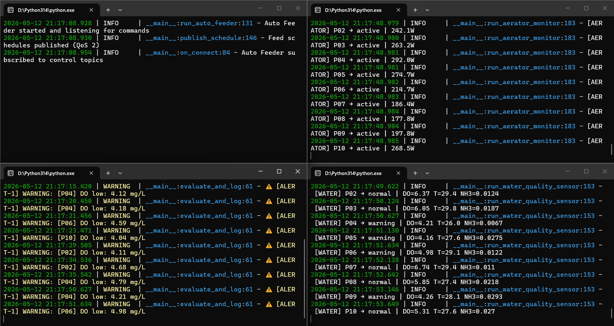
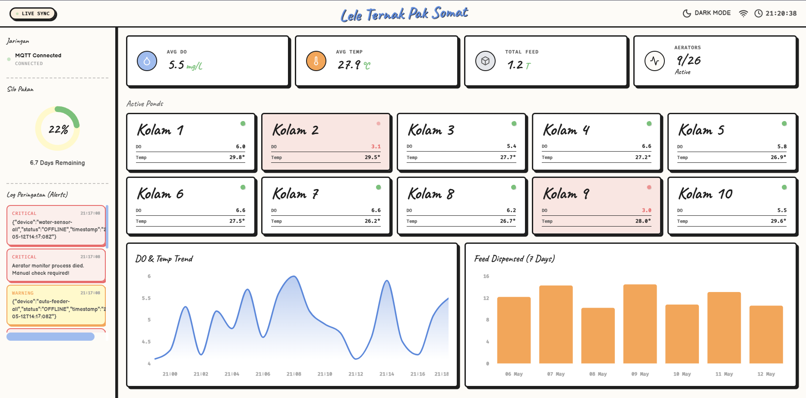
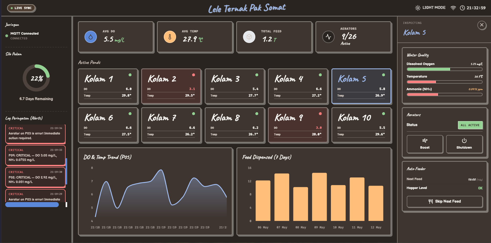
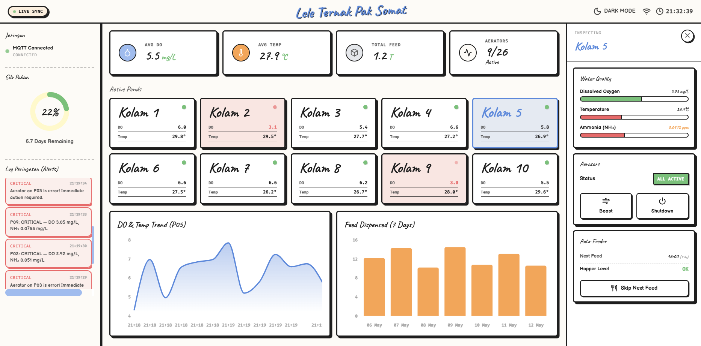

# **Ternak Lele Pak Somat - (Sistem Monitoring dan Kontrol Tambak Lele Berbasis MQTT v5)**

> **Proyek Mata Kuliah Integrasi Sistem**

| Identitas |  |
|---|---|
| Anggota 1 | Aditya Reza Daffansyah  [5027241034] |
| Anggota 2 | Ahmad Rafi Fadhillah Dwiputra [5027241068] |
| Program Studi | Teknologi Informasi |
| Tahun Akademik | 2025/2026 (Semester 4) |

---

## **Deskripsi Singkat Proyek**

Industri akuakultur, khususnya budidaya ikan lele, memerlukan pemantauan parameter kualitas air secara berkelanjutan dan otomasi pemberian pakan untuk menjaga produktivitas. Pendekatan konvensional yang mengandalkan pengukuran manual rentan terhadap keterlambatan respons saat terjadi kondisi kritis.

Sistem ini mensimulasikan jaringan sensor dan aktuator pada **10 kolam tambak lele** secara penuh melalui perangkat lunak. Setiap kolam memiliki simulator sensor kualitas air (Dissolved Oxygen, suhu, pH, amonia), aerator, dan sistem pemberian pakan otomatis. Seluruh data dikirimkan secara real-time ke **EMQX Broker v5** melalui protokol MQTT, kemudian divisualisasikan pada **Web Dashboard** berbasis React yang terhubung melalui WebSocket.

Proyek ini mengimplementasikan **11 fitur inti MQTT v5** secara eksplisit: Publish-Subscribe Pattern, Wildcard Subscription, Retained Message, Message Expiry Interval, User Property, Topic Alias, Last Will and Testament (LWT), Request-Response Pattern, Shared Subscription, Flow Control, dan integrasi WebSocket untuk dashboard real-time. Seluruh implementasi bersifat 100% simulasi software tanpa perangkat keras fisik.





---

## **Daftar Isi**

1. [Deskripsi Singkat Proyek](#deskripsi-singkat-proyek)
2. [Arsitektur Sistem](#arsitektur-sistem)
3. [Desain Topik (Topic Tree)](#desain-topik-topic-tree)
4. [Fitur-Fitur MQTT v5](#fitur-fitur-mqtt-v5)
   - 4.1 [Retained Message](#41-retained-message-pesan-tersimpan)
   - 4.2 [Message Expiry](#42-message-expiry-kedaluwarsa-pesan)
   - 4.3 [User Property](#43-user-property-metadata-ekstra)
   - 4.4 [Topic Alias](#44-topic-alias-kompresi-topik)
   - 4.5 [Last Will Testament](#45-last-will-testament-lwt)
   - 4.6 [Request-Response Pattern](#46-request-response-pattern)
   - 4.7 [Shared Subscription](#47-shared-subscription-load-balancing)
   - 4.8 [Flow Control](#48-flow-control--overload-scenario)
5. [Dashboard Monitoring](#dashboard-monitoring)
6. [Struktur Proyek](#struktur-proyek)
7. [Cara Menjalankan](#cara-menjalankan-proyek)
8. [Konfigurasi Penting](#konfigurasi-penting)
9. [Teknologi yang Digunakan](#teknologi-yang-digunakan)

---

## **Arsitektur Sistem**

### **Paradigma Publish-Subscribe**

Seluruh arsitektur dibangun di atas paradigma **Publish-Subscribe** asinkron yang dimediasi oleh **EMQX Broker v5** (berjalan di Docker). Tidak ada komunikasi langsung antar klien. Semua pesan diarahkan melalui broker.

### Komponen Sistem

| Komponen | Peran | File |
|---|---|---|
| **EMQX Broker** | Pusat distribusi pesan, manajemen sesi, load balancing | `broker/emqx.conf` |
| **Water Quality Sensor** | Simulasi sensor DO, suhu, pH, amonia, turbiditas | `publishers/water_quality_sensor.py` |
| **Aerator Monitor** | Status kincir air + kontrol Boost/Shutdown dari Dashboard | `publishers/aerator_monitor.py` |
| **Auto Feeder** | Jadwal pakan otomatis + kontrol Skip dari Dashboard | `publishers/auto_feeder.py` |
| **Feed Stock Monitor** | Pemantauan silo pakan pusat | `publishers/feed_stock_monitor.py` |
| **Farm Operator** | Simulasi input manual (siklus, mortalitas, treatment) | `publishers/farm_operator.py` |
| **Alert System** | 2 instance Shared Subscription untuk load balancing | `subscribers/alert_system.py` |
| **Farm Log** | Logger seluruh lalu lintas MQTT ke file `.jsonl` | `subscribers/farm_log.py` |
| **Web Dashboard** | React SPA terhubung via WebSocket port 8083 | `smart-catfish-farm/` |

### **Diagram Arsitektur dan Alur Data**


```
[Sensor Simulasi]                    [EMQX Broker v5]                    [Konsumen]
                                     Port 1883 (TCP)
water_quality_sensor.py ──publish──►  ┌──────────────┐  ──subscribe──►  alert_system.py (×2)
aerator_monitor.py      ──publish──►  │              │  ──subscribe──►  farm_log.py
auto_feeder.py          ──publish──►  │  EMQX v5     │  ──subscribe──►  Web Dashboard (WS:8083)
feed_stock_monitor.py   ──publish──►  │  (Docker)    │
farm_operator.py        ──publish──►  └──────────────┘
                                     Port 8083 (WebSocket)
                                     Port 18083 (Admin UI)
```

Setiap publisher terhubung menggunakan helper standar yang memastikan koneksi MQTT v5:

```python
# config/mqtt_helpers.py — Helper koneksi standar
def make_client(client_id: str, receive_maximum: int = 20) -> mqtt.Client:
    client = mqtt.Client(
        client_id=client_id,
        protocol=mqtt.MQTTv5,
        callback_api_version=mqtt.CallbackAPIVersion.VERSION2,
    )
    # Flow Control: deklarasi kapasitas in-flight messages
    connect_props = Properties(PacketTypes.CONNECT)
    connect_props.ReceiveMaximum = receive_maximum
    client._connect_properties = connect_props
    return client
```

---

## **Desain Topik (Topic Tree)**

### **Hierarki Topik**

Seluruh topik mengikuti struktur berhierarki yang konsisten dan terstruktur di `config/settings.py`:

```python
class Topics:
    # Kualitas Air — farm/pond/{id}/water/{parameter}
    WATER_ALL       = "farm/pond/{pond_id}/water/all"
    WATER_DO        = "farm/pond/{pond_id}/water/do"
    WATER_TEMP      = "farm/pond/{pond_id}/water/temperature"

    # Aerator — farm/pond/{id}/aerator/{sub}
    AERATOR_STATUS  = "farm/pond/{pond_id}/aerator/status"
    AERATOR_POWER   = "farm/pond/{pond_id}/aerator/power"

    # Feeder — farm/pond/{id}/feeder/{sub}
    FEEDER_STATUS   = "farm/pond/{pond_id}/feeder/status"
    FEEDER_DISPENSED = "farm/pond/{pond_id}/feeder/dispensed"

    # Peringatan — farm/alerts/{severity}
    ALERT_CRITICAL  = "farm/alerts/critical"
    ALERT_WARNING   = "farm/alerts/warning"

    # Gudang Pakan — farm/storage/{parameter}
    FEED_STOCK      = "farm/storage/feed_stock"
```

### **Single-Level Wildcard (`+`)**

Digunakan oleh **Farm Log System** untuk menangkap data dari semua kolam pada kategori tertentu:

```python
# subscribers/farm_log.py
SUBSCRIPTIONS = [
    ("farm/pond/+/water/#",   1),   # semua parameter air, semua kolam
    ("farm/pond/+/aerator/#", 1),   # status aerator, semua kolam
    ("farm/pond/+/feeder/#",  1),   # data feeder, semua kolam
    ("farm/storage/#",        1),   # stok pakan
    ("farm/alerts/#",         1),   # semua peringatan
]
```

Karakter `+` mencocokkan tepat 1 level — sehingga `farm/pond/+/water/#` menangkap `farm/pond/P01/water/all`, `farm/pond/P02/water/all`, dst.

### **Multi-Level Wildcard (`#`)**

Digunakan oleh **Web Dashboard** untuk menangkap seluruh data dalam satu subscription:

```javascript
// smart-catfish-farm/src/hooks/useMqtt.js
const SUBSCRIPTIONS = ['farm/#']  // Tangkap SEMUA sub-topik
```

Cukup satu subscription `farm/#` untuk menerima data dari seluruh sensor, aerator, feeder, peringatan, dan stok pakan.

---

## **Fitur-Fitur MQTT v5**

Bagian ini menjelaskan implementasi 8 fitur inti MQTT v5 yang digunakan dalam sistem.

### **4.1 Retained Message (Pesan Tersimpan)**

Flag `retain=True` disematkan pada data yang bersifat **status terakhir yang harus selalu tersedia**, sehingga subscriber baru langsung mendapatkan nilai terkini tanpa menunggu siklus publish berikutnya.

### **Implementasi pada Publisher**

```python
# publishers/aerator_monitor.py — Status aerator di-retain
client.publish(topic, payload, qos=1, retain=True, properties=props)

# publishers/auto_feeder.py — Jadwal pakan dan sisa hopper di-retain
client.publish(topic, payload, qos=2, retain=True, properties=props)

# publishers/feed_stock_monitor.py — Stok pakan gudang di-retain
client.publish(Topics.FEED_STOCK, json.dumps(payload), qos=1, retain=True)
```

### **Dampak pada Dashboard**

Ketika user membuka browser atau koneksi WebSocket terputus lalu reconnect, broker EMQX mengirimkan cache retained message terakhir. Dashboard langsung menampilkan data terkini tanpa menunggu 5-10 detik siklus publish reguler.

---

### **4.2 Message Expiry (Kedaluwarsa Pesan)**

Properti eksklusif MQTT v5 `MessageExpiryInterval` digunakan untuk mencegah data sensor usang (*stale*) tetap beredar jika publisher mati mendadak.

```python
# publishers/water_quality_sensor.py — Data kedaluwarsa 30 detik
props = Properties(PacketTypes.PUBLISH)
props.MessageExpiryInterval = 30  # detik

# publishers/aerator_monitor.py — Status kedaluwarsa 60 detik
props = make_publish_props(expiry_seconds=60, ...)
```

Fungsi helper `make_publish_props` di `config/mqtt_helpers.py`:

```python
def make_publish_props(expiry_seconds=None, user_props=None, ...):
    props = Properties(PacketTypes.PUBLISH)
    if expiry_seconds is not None:
        props.MessageExpiryInterval = expiry_seconds
    if user_props:
        for k, v in user_props.items():
            props.UserProperty = (str(k), str(v))
    return props
```

---

### **4.3 User Property (Metadata Ekstra)**


MQTT v5 User Property berfungsi seperti HTTP Headers — metadata tambahan tanpa mengubah format payload JSON.

```python
# publishers/water_quality_sensor.py
props.UserProperty = ("pond_id", pond_id)
props.UserProperty = ("operator_id", operator_id)
props.UserProperty = ("cycle_day", str(cycle_day))

# publishers/auto_feeder.py
props = make_publish_props(
    user_props={"pond_id": pond_id, "cycle_day": str(cycle_day), "device_id": f"feeder-{pond_id}"},
)
```

Di sisi subscriber, metadata diekstrak dari header tanpa perlu mem-parsing payload:

```python
# subscribers/farm_log.py
if props and hasattr(props, "UserProperty") and props.UserProperty:
    record["user_props"] = dict(props.UserProperty)
```

---

### 4.4 Topic Alias (Kompresi Topik)

Mekanisme kompresi bandwidth MQTT v5 yang menggantikan string topik panjang dengan integer pendek setelah registrasi awal.

```python
# publishers/water_quality_sensor.py
ALIAS_MAP: dict[str, int] = {}
ALIAS_COUNTER = 1

def _get_or_register_alias(client, topic):
    global ALIAS_COUNTER
    props = Properties(PacketTypes.PUBLISH)
    props.MessageExpiryInterval = 30

    if topic not in ALIAS_MAP:
        # Registrasi pertama: kirim topik lengkap + alias number
        alias = ALIAS_COUNTER
        ALIAS_MAP[topic] = alias
        ALIAS_COUNTER += 1
        props.TopicAlias = alias
        return topic, props  # kirim topik lengkap
    else:
        # Selanjutnya: kirim alias saja, topik kosong
        props.TopicAlias = ALIAS_MAP[topic]
        return "", props  # hemat bandwidth
```

Pada pengiriman pertama, topik lengkap `farm/pond/P01/water/all` (32 karakter) dikirim bersama alias `1`. Setelah itu, hanya integer `1` yang dikirim, menghemat 31 byte per pesan per kolam.

---

### **4.5 Last Will Testament (LWT)**

Setiap publisher kritis mendaftarkan "wasiat" saat koneksi awal. Jika proses mati tidak wajar (crash, listrik padam), broker otomatis mempublikasikan pesan peringatan.

```python
# publishers/aerator_monitor.py — LWT severity: CRITICAL
connect_v5(
    client, host=BROKER_HOST, port=BROKER_PORT,
    lwt_topic=Topics.ALERT_CRITICAL,  # "farm/alerts/critical"
    lwt_payload={
        "device": "aerator-monitor-all",
        "status": "OFFLINE",
        "message": "Aerator monitor process died. Manual check required!",
        "timestamp": ts(),
    },
    lwt_qos=1,
)

# publishers/auto_feeder.py — LWT severity: WARNING
connect_v5(
    client, host=BROKER_HOST, port=BROKER_PORT,
    lwt_topic=Topics.ALERT_WARNING,
    lwt_payload={"device": "auto-feeder-all", "status": "OFFLINE", "timestamp": ts()},
    lwt_qos=1,
)
```

Implementasi `connect_v5` di helper:

```python
def connect_v5(client, host, port, keepalive=60, lwt_topic=None, lwt_payload=None, lwt_qos=1):
    if lwt_topic and lwt_payload:
        client.will_set(
            topic=lwt_topic,
            payload=json.dumps(lwt_payload),
            qos=lwt_qos, retain=False,
        )
    props = getattr(client, "_connect_properties", Properties(PacketTypes.CONNECT))
    client.connect(host, port, keepalive=keepalive, properties=props)
```

Ketika proses publisher tiba-tiba mati, Alert System dan Dashboard langsung menerima notifikasi kritis.

---

### **4.6 Request-Response Pattern**

Walaupun MQTT fundamentalnya bersifat satu arah dan asinkron (fire-and-forget dari publisher ke subscriber), ada skenario di mana administrator tambak membutuhkan data diagnostik **on-demand** — misalnya menarik snapshot status lengkap satu kolam tertentu tanpa harus menunggu siklus publish reguler sensor. Untuk skenario ini, sistem mengimplementasikan **Request-Response Pattern** menggunakan dua properti eksklusif MQTT v5: `ResponseTopic` dan `CorrelationData`.

### **Mengapa Perlu Request-Response di MQTT?**

Pada arsitektur Pub/Sub biasa, subscriber menerima data secara pasif sesuai jadwal publisher. Namun dalam kasus berikut, pendekatan pasif tidak cukup:
- Admin ingin **menarik laporan status kolam P03 sekarang juga** tanpa menunggu sensor mengirimkan data pada siklus 5 detik berikutnya
- Sistem perlu melakukan **health check** atau **diagnostik** terhadap kolam tertentu
- Operator memerlukan **snapshot gabungan** (air + aerator + feeder) dalam satu respons terkonsolidasi

### **Arsitektur dan Alur Komunikasi**

```
                     EMQX BROKER v5
                    ┌──────────────┐
  REQUESTER         │              │         RESPONDER
  (pond_status_     │   Routing    │         (pond_status_
   requester.py)    │              │          responder.py)
       │            │              │              │
       │  ①PUBLISH  │              │              │
       ├───────────►│ Topic:       │  ②FORWARD    │
       │            │ farm/request/├─────────────►│
       │            │ pond_status/ │              │
       │            │ P03          │              │
       │            │              │              │
       │            │ Header:      │              │ ③ Proses permintaan:
       │            │ ResponseTopic│              │    - Cek cache data terbaru
       │            │ Correlation  │              │    - Gabungkan water+aerator+feeder
       │            │ Data         │              │    - Susun JSON respons
       │            │              │              │
       │            │              │  ④PUBLISH    │
       │  ⑤RECEIVE  │ Topic:       │◄─────────────┤
       │◄───────────│ farm/response│              │
       │            │ /pond_status/│              │
       │            │ P03/{corr_id}│              │
       │            │              │              │
       │            │ Header:      │              │
       │            │ CorrelationD.│              │
       └            └──────────────┘              └
```

### **Langkah Demi Langkah**

| Langkah | Aktor | Aksi |
|---|---|---|
| **1** | Requester | Membuat `correlation_id` unik (UUID 8-char), menyusun `ResponseTopic` khusus, lalu PUBLISH permintaan ke `farm/request/pond_status/{pond_id}` dengan header `ResponseTopic` + `CorrelationData` |
| **2** | Broker | Meneruskan pesan ke Responder yang subscribe ke `farm/request/pond_status/+` |
| **3** | Responder | Menerima pesan, membaca `ResponseTopic` dan `CorrelationData` dari header, mengumpulkan data terkini dari cache internal, menyusun JSON respons gabungan |
| **4** | Responder | PUBLISH respons **hanya** ke `ResponseTopic` yang diberikan requester, menyertakan `CorrelationData` yang sama sebagai validasi |
| **5** | Requester | Menerima respons di topik khusus miliknya, memverifikasi `CorrelationData` cocok, lalu memproses data |

### Implementasi Requester (Pengirim Permintaan)

File: `request_response/pond_status_requester.py`

```python
import json, time, sys
from paho.mqtt.properties import Properties
from paho.mqtt.packettypes import PacketTypes
from config.mqtt_helpers import make_client, connect_v5, new_correlation_id, ts

def request_pond_status(pond_id: str, timeout: float = 5.0) -> dict | None:
    # 1 Generate identifier unik untuk korelasi request-response
    correlation_id = new_correlation_id()  # UUID 8 karakter, misal "a3f7b2c1"

    # Konstruksi topik respons KHUSUS untuk requester ini
    # Format: farm/response/pond_status/{pond_id}/{correlation_id}
    # Topik ini unik per-request sehingga tidak ada requester lain yang menerima
    response_topic = f"farm/response/pond_status/{pond_id}/{correlation_id}"

    # Buat client dengan ReceiveMaximum rendah (hanya butuh 1 respons)
    client = make_client(client_id=f"requester-{correlation_id}", receive_maximum=4)
    connect_v5(client, host="localhost", port=1883)

    response_holder = []  # Penampung respons (list agar bisa diakses dari closure)

    def on_connect(c, u, flags, reason_code, props):
        if reason_code == 0:
            # 2) Subscribe ke topik respons SEBELUM mengirim request
            # Ini mencegah race condition di mana respons tiba sebelum subscribe aktif
            c.subscribe(response_topic, qos=1)

    def on_message(c, u, msg, props=None):
        try:
            data = json.loads(msg.payload)
            # 3) Verifikasi CorrelationData cocok — KEAMANAN
            # Mencegah respons palsu dari klien lain di jaringan
            if props and hasattr(props, "CorrelationData"):
                received_cid = props.CorrelationData.decode()
                if received_cid != correlation_id:
                    return  # Abaikan jika correlation tidak cocok
            response_holder.append(data)
        except json.JSONDecodeError:
            pass

    client.on_connect = on_connect
    client.on_message = on_message
    client.loop_start()
    time.sleep(0.3)  # Tunggu subscribe selesai

    # 4) Susun header MQTT v5 dengan ResponseTopic + CorrelationData
    req_props = Properties(PacketTypes.PUBLISH)
    req_props.ResponseTopic   = response_topic           # "Balas ke sini"
    req_props.CorrelationData = correlation_id.encode()   # "Pakai sandi ini"

    # PUBLISH request ke topik yang didengarkan Responder
    request_topic = f"farm/request/pond_status/{pond_id}"
    client.publish(
        request_topic,
        json.dumps({"pond_id": pond_id, "requested_at": ts()}),
        qos=1,
        properties=req_props,
    )

    # Tunggu respons dengan timeout
    deadline = time.time() + timeout
    while time.time() < deadline:
        if response_holder:
            client.loop_stop()
            client.disconnect()
            return response_holder[0]
        time.sleep(0.1)

    # Timeout — tidak ada respons
    client.loop_stop()
    client.disconnect()
    return None
```

**Poin penting pada Requester:**
- `correlation_id` di-generate menggunakan `uuid.uuid4()[:8]` — cukup unik untuk mencegah tabrakan antar request bersamaan
- Subscribe ke `response_topic` dilakukan **sebelum** mengirim request, mencegah *race condition*
- Verifikasi `CorrelationData` pada respons adalah lapisan keamanan yang memastikan respons benar-benar untuk request ini, bukan data liar dari klien lain

### **Implementasi Responder (Backend Pelayan)**

File: `request_response/pond_status_responder.py`

```python
import json
from paho.mqtt.properties import Properties
from paho.mqtt.packettypes import PacketTypes
from config.mqtt_helpers import make_client, connect_v5, ts

# Cache data terbaru per kolam — diisi dari subscription pasif
pond_cache: dict[str, dict] = {}

def run_responder():
    client = make_client(client_id="pond-status-responder", receive_maximum=8)
    connect_v5(client, host="localhost", port=1883)

    def on_connect(c, u, flags, reason_code, props):
        if reason_code == 0:
            # Subscribe data terkini dari semua kolam (untuk mengisi cache)
            c.subscribe("farm/pond/+/water/all",      qos=1)
            c.subscribe("farm/pond/+/aerator/status",  qos=1)
            c.subscribe("farm/pond/+/feeder/status",   qos=1)

            # Subscribe ke topik request (wildcard + untuk semua pond_id)
            c.subscribe("farm/request/pond_status/+",  qos=1)

    def on_message(c, u, msg, props=None):
        topic_parts = msg.topic.split("/")

        # ── Pesan data biasa → simpan ke cache ────────────────────────
        if "request" not in topic_parts:
            try:
                data = json.loads(msg.payload)
                pond_id = data.get("pond_id")
                if pond_id:
                    if pond_id not in pond_cache:
                        pond_cache[pond_id] = {}
                    # Kategorikan berdasarkan tipe topik
                    if "water" in topic_parts:
                        pond_cache[pond_id]["water"] = data
                    elif "aerator" in topic_parts:
                        pond_cache[pond_id]["aerator"] = data
                    elif "feeder" in topic_parts:
                        pond_cache[pond_id]["feeder"] = data
            except json.JSONDecodeError:
                pass
            return  # Bukan request, selesai

        # ── Pesan REQUEST → proses dan balas ──────────────────────────
        pond_id = topic_parts[-1]  # farm/request/pond_status/{pond_id}

        # ③ Validasi: request HARUS punya ResponseTopic
        if not props or not hasattr(props, "ResponseTopic") or not props.ResponseTopic:
            return  # Abaikan request tanpa ResponseTopic

        response_topic = props.ResponseTopic
        correlation_data = getattr(props, "CorrelationData", b"")

        # Kumpulkan data terkini dari cache
        cached = pond_cache.get(pond_id, {})
        response = {
            "pond_id"  : pond_id,
            "water"    : cached.get("water",   {"status": "no_data"}),
            "aerator"  : cached.get("aerator", {"status": "no_data"}),
            "feeder"   : cached.get("feeder",  {"status": "no_data"}),
            "timestamp": ts(),
        }

        # ④ Balas HANYA ke ResponseTopic yang diminta, dengan CorrelationData identik
        resp_props = Properties(PacketTypes.PUBLISH)
        if correlation_data:
            resp_props.CorrelationData = correlation_data  # Echo balik sandi

        c.publish(
            response_topic,
            json.dumps(response),
            qos=1,
            properties=resp_props,
        )

    client.on_connect = on_connect
    client.on_message = on_message
    client.loop_forever()  # Berjalan terus sebagai daemon
```

**Poin penting pada Responder:**
- Responder bertindak sebagai **cache aggregator** — ia subscribe ke topik data (`water/all`, `aerator/status`, `feeder/status`) secara pasif dan menyimpannya di `pond_cache`
- Ketika request masuk, ia **tidak** mengambil data langsung dari sensor, melainkan menyajikan data terbaru yang sudah di-cache
- Respons dikirim **hanya** ke `ResponseTopic` yang disertakan requester — ini mencegah data sensitif bocor ke subscriber lain yang mungkin mendengarkan topik publik

### **Fungsi Helper Pendukung**

```python
# config/mqtt_helpers.py

def new_correlation_id() -> str:
    """Generate UUID pendek 8 karakter untuk korelasi request-response."""
    return str(uuid.uuid4())[:8]

def make_publish_props(response_topic=None, correlation_data=None, ...):
    """Builder untuk MQTT v5 PUBLISH properties."""
    props = Properties(PacketTypes.PUBLISH)
    if response_topic:
        props.ResponseTopic = response_topic
    if correlation_data:
        props.CorrelationData = correlation_data.encode()
    return props
```

### **Keamanan dan Isolasi**

Mekanisme `ResponseTopic` + `CorrelationData` memberikan dua lapisan keamanan:

1. **Isolasi Topik**: Setiap request mendapatkan topik respons unik (`farm/response/pond_status/P03/a3f7b2c1`). Requester lain yang mengirim request berbeda tidak akan menerima respons ini karena subscribe ke topik yang berbeda.

2. **Validasi Korelasi**: Meskipun secara teori klien lain bisa subscribe ke topik respons (jika menebak UUID-nya), field `CorrelationData` bertindak sebagai "sandi" validasi. Requester memverifikasi bahwa `CorrelationData` dalam respons cocok persis dengan yang dikirimkan — jika tidak cocok, respons diabaikan.

### **Penggunaan dan Contoh Output**

```bash
# Jalankan responder terlebih dahulu (sudah berjalan via run_all.ps1)
python -m request_response.pond_status_responder

# Di terminal lain, kirim request untuk kolam P03
python -m request_response.pond_status_requester P03
```

Output contoh:
```json
{
  "pond_id": "P03",
  "water": {
    "pond_id": "P03",
    "do": 5.82,
    "temperature": 29.1,
    "ph": 7.34,
    "ammonia": 0.0215,
    "turbidity": 12.4,
    "status": "normal",
    "timestamp": "2026-05-12T09:00:00Z"
  },
  "aerator": {
    "pond_id": "P03",
    "status": "active",
    "power_consumption": 234.5,
    "timestamp": "2026-05-12T09:00:02Z"
  },
  "feeder": {
    "pond_id": "P03",
    "status": "standby",
    "remaining_kg": 8.21,
    "last_fed": "2026-05-12T06:00:05Z",
    "timestamp": "2026-05-12T09:00:01Z"
  },
  "timestamp": "2026-05-12T09:00:03Z"
}
```

Jika kolam belum memiliki data (misal responder baru dimulai), field akan menampilkan `{"status": "no_data"}`. Jika tidak ada respons dalam 5 detik (timeout default), requester menampilkan `"No response received."`.

---

### **4.7 Shared Subscription (Load Balancing)**

Dua instance **Alert System** dijalankan bersamaan dalam satu grup shared subscription. EMQX mendistribusikan pesan secara round-robin.

### **Implementasi**

```python
# subscribers/alert_system.py — Instance 1 dan 2 menggunakan prefix yang sama
shared_prefix = "$share/alert-group/"
subs = [
    (f"{shared_prefix}farm/alerts/#",              1),
    (f"{shared_prefix}farm/pond/+/water/all",      1),
    (f"{shared_prefix}farm/pond/+/aerator/status",  1),
    (f"{shared_prefix}farm/pond/+/feeder/status",   1),
]
```

### **Cara Kerja**

```
                                    ┌─ alert_system.py instance 1 (menerima pesan A, C, E, ...)
farm/alerts/critical ──► EMQX ──►──┤
                                    └─ alert_system.py instance 2 (menerima pesan B, D, F, ...)
```

Setiap pesan hanya dikirim ke **satu** instance dalam grup, bukan dua-duanya. Ini mencegah notifikasi duplikat dan mempercepat pemrosesan saat beban tinggi.

### **Menjalankan**

```powershell
# Di run_all.ps1 — dua instance terpisah:
Start-Process python -ArgumentList "-m subscribers.alert_system 1"
Start-Process python -ArgumentList "-m subscribers.alert_system 2"
```

---

### **4.8 Flow Control / Overload Scenario**


Parameter `ReceiveMaximum` dideklarasikan saat koneksi untuk membatasi jumlah pesan QoS 1/2 yang boleh *in-flight* (belum di-ACK) secara bersamaan.

```python
# config/mqtt_helpers.py
def make_client(client_id, receive_maximum=20):
    client = mqtt.Client(
        client_id=client_id,
        protocol=mqtt.MQTTv5,
        callback_api_version=mqtt.CallbackAPIVersion.VERSION2,
    )
    connect_props = Properties(PacketTypes.CONNECT)
    connect_props.ReceiveMaximum = receive_maximum  # Batas in-flight
    client._connect_properties = connect_props
    return client
```

Setiap komponen memiliki batas berbeda sesuai kapasitasnya:

| Komponen | `ReceiveMaximum` | Alasan |
|---|---|---|
| Water Sensor | 16 | Publisher utama, cukup 16 buffer |
| Aerator Monitor | 16 | Perlu headroom untuk kontrol command |
| Auto Feeder | 16 | QoS 2 butuh 2x handshake per pesan |
| Feed Stock Monitor | 8 | Hanya terima event dispensed |
| Alert System | 32 | Harus cepat serap banyak alert |
| Pond Status Responder | 8 | Hanya request-response |
| Requester | 4 | Satu request saja |

Jika broker mengirim lebih dari limit ini, klien akan menahan pengiriman hingga pesan sebelumnya di-ACK — mencegah buffer overflow dan crash.

---

## **Dashboard Monitoring**

Dashboard dibangun menggunakan React + Vite dan terhubung ke EMQX Broker melalui WebSocket (port 8083). Dashboard berperan sebagai **Subscriber** (menerima data sensor) sekaligus **Publisher** (mengirim perintah kontrol ke kolam).





### **Koneksi MQTT WebSocket**

Dashboard React SPA terhubung ke EMQX melalui **WebSocket** (port 8083) menggunakan library `mqtt.js` dengan protokol MQTT v5.


```javascript
// smart-catfish-farm/src/hooks/useMqtt.js
import mqtt from 'mqtt'

const client = mqtt.connect('ws://localhost:8083/mqtt', {
  protocolVersion: 5,
  clientId: `dashboard-${Math.random().toString(16).slice(2, 8)}`,
  clean: true,
  reconnectPeriod: 3000,
})

client.on('connect', () => {
  client.subscribe('farm/#', { qos: 1 })  // Tangkap SEMUA topik

  // Simpan fungsi publish ke Zustand store agar bisa dipanggil dari komponen manapun
  setMqttPublish((topic, message) => {
    if (client.connected) {
      client.publish(topic, JSON.stringify(message), { qos: 1 })
    }
  })
})
```

### **State Management (Zustand Store)**

```javascript
// smart-catfish-farm/src/store/useFarmStore.js
handleMessage: (topic, payload) => {
  const parts = topic.split('/')
  const section = parts[3]  // 'water', 'aerator', 'feeder', 'cycle', 'health'
  const sub = parts[4]      // 'all', 'status', 'control', dll

  // Filter pesan kontrol (echo dari perintah sendiri)
  if (section === 'aerator' && sub !== 'control') {
    pond.aerator = { ...(pond.aerator ?? {}), ...payload }
  }
  if (section === 'feeder' && sub !== 'control') {
    pond.feeder = { ...(pond.feeder ?? {}), ...payload }
  }
}
```

### K**ontrol Bi-Directional (Dashboard → Backend)**

Tombol di Dashboard mengirim perintah MQTT ke backend:

```javascript
// DetailPanel.jsx — Tombol Aerator
const handleAction = (action) => {
  // action = 'boost' atau 'shutdown'
  publish(`farm/pond/${pondId}/aerator/control`, { action })
}

// DetailPanel.jsx — Tombol Skip Feed
const handleSkip = () => {
  publish(`farm/pond/${pondId}/feeder/control`, { action: 'skip_next' })
}
```

Backend menerima dan langsung mempublikasikan status terbaru:

```python
# publishers/aerator_monitor.py — on_message handler
def on_message(client, userdata, msg):
    payload = json.loads(msg.payload)
    pond_id = msg.topic.split("/")[2]
    action = payload.get("action")

    sim = simulators[pond_id]
    sim.handle_command(action)  # Ubah state internal

    # Publish status terbaru SEGERA (tidak menunggu tick berikutnya)
    client.publish(
        Topics.fmt(Topics.AERATOR_STATUS, pond_id=pond_id),
        json.dumps({"pond_id": pond_id, "status": sim.status, "timestamp": ts()}),
        qos=1, retain=True,
    )
```

### **Fitur Dashboard**

| Widget | Data Source | Topik MQTT |
|---|---|---|
| Pond Grid (10 kolam) | Water Quality Sensor | `farm/pond/+/water/all` |
| Detail Panel (kanan) | Semua sensor + kontrol | `farm/pond/{id}/#` |
| Feed Silo Gauge | Feed Stock Monitor | `farm/storage/feed_stock` |
| Alert Feed | Alert System | `farm/alerts/#` |
| DO Trend Chart | Historis per kolam | Akumulasi dari `water/all` |
| Live Stats Bar | Aggregasi real-time | Kalkulasi dari semua `water/all` |

### **Header (Status Koneksi dan Waktu)**

Header dashboard menampilkan tiga area:
- **Kiri**: Indikator koneksi MQTT real-time (Live Sync / Disconnected).
- **Tengah**: Judul sistem "Lele Ternak Pak Somat".
- **Kanan**: Tombol Dark/Light Mode, ikon koneksi WiFi, dan jam digital real-time.

### **Sidebar Kiri (Ringkasan dan Log Peringatan)**

Sidebar kiri memuat:
- **Status koneksi MQTT** secara detail (Connected / Disconnected / Reconnecting).
- **Indikator Silo Pakan** berupa donut chart persentase stok pakan yang tersisa beserta estimasi hari ketahanan stok.
- **Log Peringatan (Alerts)** berupa daftar pesan peringatan terbaru yang diterima dari topik `farm/alerts/#`, ditampilkan secara kronologis dengan label tingkat keparahan (WARNING / CRITICAL).

### **Grid Kolam (Pemantauan 10 Kolam Sekaligus)**

Area utama menampilkan 10 kartu kolam (P01-P10) dalam tata letak grid 5 kolam per baris. Setiap kartu menampilkan:
- ID kolam dengan tipografi besar.
- Nilai Dissolved Oxygen (DO) terkini dalam mg/L.
- Suhu air terkini dalam derajat Celcius.
- Indikator status warna: Hijau (Normal), Kuning (Warning), Merah (Critical), Abu-abu (Offline).

### **Panel Detail Kolam (Monitoring dan Kontrol)**

Mengklik salah satu kartu kolam membuka panel detail di sisi kanan layar:

**Water Quality:** Nilai DO, Suhu, dan Amonia dengan indikator batang berwarna (hijau/kuning/merah sesuai ambang batas).

**Aerators:** Status aktif/non-aktif seluruh aerator kolam, dilengkapi dua tombol kontrol:
- Tombol **Boost** — mengirim `{"action": "boost"}` ke `farm/pond/{id}/aerator/control`.
- Tombol **Shutdown** — mengirim `{"action": "shutdown"}` ke topik yang sama.

**Auto-Feeder:** Waktu pemberian pakan berikutnya, level stok hopper (OK/LOW), dan tombol **Skip Next Feed** yang mengirim `{"action": "skip_next"}` ke `farm/pond/{id}/feeder/control`.

### **Grafik Real-Time**

Bagian bawah area utama menampilkan dua grafik:
- **DO Trend Chart**: Grafik area (area chart) yang menampilkan tren Dissolved Oxygen dari kolam yang sedang dipilih dalam 20 data point terakhir.
- **Feed Dispensed (7 Days)**: Grafik batang (bar chart) yang menampilkan total pakan yang diberikan selama 7 hari terakhir.


### **Statistik Agregat (Live Stats Bar)**

Di bawah header, terdapat baris statistik agregat yang diperbarui secara real-time:
- **AVG DO**: Rata-rata Dissolved Oxygen dari semua kolam yang online.
- **AVG TEMP**: Rata-rata suhu air dari semua kolam yang online.
- **TOTAL FEED**: Total estimasi pakan yang telah diberikan hari ini.
- **AERATORS**: Jumlah aerator aktif dibanding total keseluruhan.

---

## **Struktur Proyek**

```
Insis-MQTT/
├── broker/
│   └── emqx.conf                     # Konfigurasi EMQX Docker (MQTT v5)
├── config/
│   ├── settings.py                    # Konstanta: topik, port, threshold, jadwal pakan
│   └── mqtt_helpers.py                # Wrapper paho-mqtt: make_client, connect_v5, dll
├── publishers/                        # 5 Publisher (simulasi perangkat IoT)
│   ├── water_quality_sensor.py        # Sensor DO, suhu, pH, amonia, turbiditas
│   ├── aerator_monitor.py             # Status aerator + terima kontrol Boost/Shutdown
│   ├── auto_feeder.py                 # Jadwal pakan + terima kontrol Skip
│   ├── feed_stock_monitor.py          # Monitor silo pakan pusat
│   └── farm_operator.py               # Simulasi input manual (siklus, mortalitas)
├── subscribers/                       # 2 Subscriber
│   ├── alert_system.py                # Shared Subscription ×2 instance
│   └── farm_log.py                    # Logger ke file .jsonl
├── request_response/                  # Request-Response Pattern
│   ├── pond_status_requester.py       # Kirim permintaan status on-demand
│   └── pond_status_responder.py       # Balas dengan data terkini
├── smart-catfish-farm/                # Frontend React Dashboard
│   ├── src/
│   │   ├── hooks/useMqtt.js           # Koneksi WebSocket MQTT + publish
│   │   ├── store/useFarmStore.js      # Zustand state + message router
│   │   ├── components/
│   │   │   ├── layout/DetailPanel.jsx # Panel detail kolam + tombol kontrol
│   │   │   ├── pond/PondCard.jsx      # Kartu kolam di grid utama
│   │   │   └── widgets/              # FeedStockGauge, AlertFeed, dll
│   │   └── utils/statusHelpers.js     # Helper format nama kolam
│   └── package.json
├── logs/                              # Output log .jsonl
├── run_all.ps1                        # Script start semua service (Windows)
├── run_all.sh                         # Script start semua service (Linux/Mac)
└── requirements.txt                   # Dependensi Python
```

---

## **Cara Menjalankan Proyek**

### **Prasyarat**
- **Docker** (untuk EMQX Broker)
- **Python 3.11+** dengan `pip`
- **Node.js 18+** dengan `npm`

### **1. Jalankan Broker EMQX**

```bash
docker rm -f emqx 2>/dev/null
docker run -d --name emqx \
  -p 1883:1883 \
  -p 8083:8083 \
  -p 18083:18083 \
  -v "${PWD}/broker/emqx.conf:/opt/emqx/etc/emqx.conf" \
  emqx/emqx:5.6.0
```

- **Admin Dashboard**: `http://localhost:18083` (username: `admin`, password: `public`)
- **Port 1883**: MQTT TCP (untuk Python publishers/subscribers)
- **Port 8083**: MQTT WebSocket (untuk React Dashboard)

### **2. Install Dependensi Backend**

```bash
pip install -r requirements.txt
```

Dependensi utama: `paho-mqtt>=2.0`, `loguru`

### **3. Install & Jalankan Frontend**

```bash
cd smart-catfish-farm
npm install
npm run dev    # Berjalan di http://localhost:5173
```

### **4. Jalankan Semua Service Backend**

```powershell
# Windows (dari root Insis-MQTT/)
.\run_all.ps1
```

Script ini menjalankan 8 proses Python di terminal terpisah:
- 2× Alert System (Shared Subscription)
- 1× Farm Log
- 1× Pond Status Responder
- 1× Feed Stock Monitor
- 1× Water Quality Sensor
- 1× Aerator Monitor
- 1× Auto Feeder

### **5. Buka Dashboard**

Buka `http://localhost:5173` di browser. Data simulasi real-time langsung muncul.

### **6. Test Request-Response (Opsional)**

```bash
python -m request_response.pond_status_requester P03
```

---

## **Alur Kontrol Dashboard → Backend**

### **Aerator (Boost / Shutdown)**

```
[Klik Boost] → Dashboard publish ke "farm/pond/P01/aerator/control" {action: "boost"}
              → EMQX Broker meneruskan ke aerator_monitor.py
              → aerator_monitor.py: sim.handle_command("boost") → status = "boost"
              → Langsung publish status terbaru ke "farm/pond/P01/aerator/status"
              → Dashboard menerima → Badge berubah menjadi "BOOST MODE" (biru)
```

### **Auto Feeder (Skip Next Feed)**

```
[Klik Skip] → Dashboard publish ke "farm/pond/P01/feeder/control" {action: "skip_next"}
            → EMQX Broker meneruskan ke auto_feeder.py
            → auto_feeder.py: feeder.handle_command("skip_next") → status = "skip_next"
            → Langsung publish status terbaru ke "farm/pond/P01/feeder/status"
            → Dashboard menerima → Badge berubah menjadi "SKIPPED" (biru)
            → Pada jadwal pakan berikutnya, kolam ini dilewati
```

### **Feed Silo (Silo Pakan)**

```
[Jadwal pakan tercapai] → auto_feeder.py: feeder.dispense() → kirim ke feeder/dispensed
                        → feed_stock_monitor.py menerima event dispensed
                        → Kurangi stock_kg → publish ke farm/storage/feed_stock (retained)
                        → Dashboard: FeedStockGauge terupdate otomatis
```

Jadwal pakan default: `06:00`, `12:00`, `18:00` (konfigurasi di `config/settings.py`).

---

## **Konfigurasi Penting**

### `config/settings.py`

```python
BROKER_HOST = "localhost"
BROKER_PORT = 1883
POND_IDS    = [f"P{str(i).zfill(2)}" for i in range(1, 11)]  # P01..P10

FEED_SCHEDULE    = ["06:00", "12:00", "18:00"]   # Jadwal pakan harian
FEED_PER_MEAL_KG = 2.5                            # Porsi per kolam per makan
FEED_STOCK_INITIAL_KG = 500.0                     # Stok awal gudang pakan
FEED_WARN_DAYS   = 3                               # Peringatan jika < 3 hari

WATER_PARAMS = {
    "do_min": 4.0, "do_max": 8.0, "do_warn_low": 5.0,
    "temp_min": 26.0, "temp_max": 32.0,
    "temp_warn_hi": 31.0, "temp_warn_lo": 24.0,
    "ph_min": 6.5, "ph_max": 8.5,
    "ammonia_max": 0.05,
}
```

---

